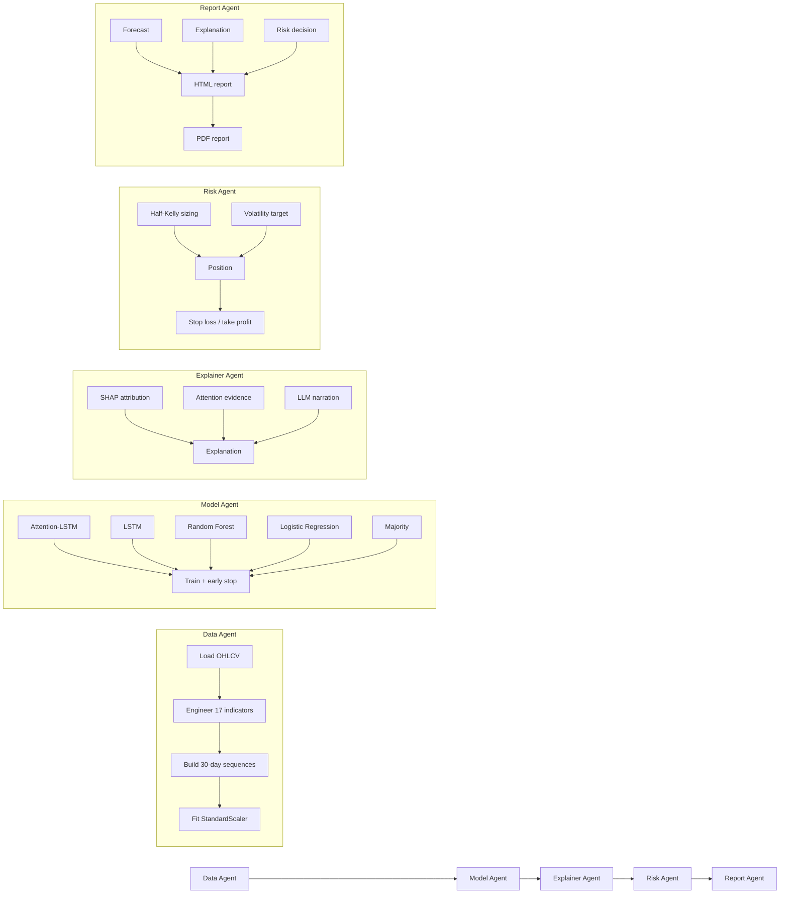

# Explanation-First Agentic Forecaster for Stock Market

> **A software reconstruction / reference implementation of**
> *Explanation-First Agentic Forecaster for Stock Market*,
> **DOI: 10.1109/IEMENTECH202669403.2026.11434302**

## Overview

This repository is a complete software reconstruction of the paper
*Explanation-First Agentic Forecaster for Stock Market*. It implements a
**five-agent pipeline** that forecasts next-day price direction for 50 NIFTY
100 constituents and explains *why* each forecast was made, before any
capital is committed.

The five agents are:

1. **Data Agent** — locates the dataset, engineers 17 technical indicators
   (RSI, MACD, ATR, volatility, Bollinger, OBV, ...), constructs the 30-day
   lookback sequences and the next-day direction target, and fits a
   `StandardScaler` on the training split only.
2. **Model Agent** — trains five model families: **Attention-LSTM** (primary),
   plain **LSTM**, **Random Forest**, **Logistic Regression** and **Majority**.
3. **Explainer Agent** — combines **SHAP** feature attribution with
   **attention evidence** to explain each prediction; supports an optional
   LLM narration layer with a deterministic fallback.
4. **Risk Agent** — converts conviction into a sized, risk-limited position
   using half-Kelly sizing, volatility targeting and stop-loss / take-profit.
5. **Report Agent** — renders per-ticker **HTML** and **PDF** reports that
   bundle the forecast, explanation, risk decision and metrics.

## Paper

- **Title:** Explanation-First Agentic Forecaster for Stock Market
- **DOI:** [10.1109/IEMENTECH202669403.2026.11434302](https://doi.org/10.1109/IEMENTECH202669403.2026.11434302)

## Scope

This reconstruction covers the full methodology described in the paper:

- 50 NIFTY 100 constituent stocks
- 17 technical indicators as input features
- 30-day lookback sequences
- Attention-LSTM primary model with four baselines
- Temperature calibration
- SHAP + attention-based explainability
- Half-Kelly risk management with volatility targeting
- Walk-forward (anchored) evaluation
- HTML and PDF per-ticker reports

## Architecture



See `docs/ARCHITECTURE.md` for the full architecture and
`docs/PAPER_TRACEABILITY.md` for the paper-to-code mapping.

## Five-Agent Workflow

| Agent | Responsibility | Entry point |
|---|---|---|
| Data | Features, target, sequencing, scaling | `DataAgent.run()` |
| Model | Train all five model families | `ModelAgent.run()` |
| Explainer | SHAP + attention evidence + LLM narration | `ExplainerAgent.run()` |
| Risk | Half-Kelly sizing, vol target, stop-loss | `RiskAgent.decide()` |
| Report | HTML/PDF per-ticker reports | `ReportAgent.run()` |

## Feature Engineering

17 technical indicators are computed per ticker on the OHLCV frame:

| Category | Indicators |
|---|---|
| Momentum | RSI-14, MACD (line, signal, histogram) |
| Volatility | ATR-14, 20-day realized volatility, Bollinger Bands (upper, lower, width) |
| Trend | SMA-20, SMA-50, EMA-12, EMA-26 |
| Volume | OBV, log-volume |
| Returns | 1-day, 5-day, 10-day returns |

The target is the next-day close-to-close direction: `1` if `close[t+1] > close[t]` else `0`.

## Attention-LSTM

The primary model uses a 2-layer LSTM (64 hidden units, dropout 0.2) with
additive (Bahdanau-style) attention over the 30 time-step outputs:

1. LSTM processes the input sequence: `(B, 30, F) -> (B, 30, 64)`
2. Additive attention scores each time step: `score_t = v^T tanh(W h_t + b)`
3. Softmax normalizes scores into attention weights: `alpha_t = softmax(score_t)`
4. Context vector is the weighted sum: `c = sum(alpha_t * h_t)`
5. Linear classifier produces logits from the context vector

Attention weights are returned alongside logits so the Explainer Agent can
surface *which days* the model attended to.

## Explainability

Three complementary explanation modes:

1. **SHAP feature attribution** — `DeepExplainer` for the torch model, with a
   permutation-based fallback when SHAP is unavailable.
2. **Attention evidence** — the top-5 most-attended days per prediction are
   extracted from the attention weight vector.
3. **LLM narration** — optional OpenAI-compatible endpoint; when disabled
   (default) a deterministic template is used. The deterministic fallback is
   the *only* explanation mode exercised in CI.

## Risk Agent

The Risk Agent converts conviction into a sized, risk-limited position:

- **Half-Kelly sizing:** `f* = 0.25 * (p * b - (1 - p)) / b` with `b = 1`
- **Volatility targeting:** `vol_size = volatility_target / realised_vol`
- **Final size:** `min(kelly_size, vol_size, max_position_pct)`
- **Stop loss:** 5% adverse move
- **Take profit:** 2x stop loss (10%)
- **Conviction bands:** low < 55%, medium 55-70%, high > 85%

## Dataset

> **Raw dataset is not stored in Git due to size.**

- **Kaggle URL:** https://www.kaggle.com/datasets/debashis74017/algo-trading-data-nifty-100-data-with-indicators
- **Slug:** `debashis74017/algo-trading-data-nifty-100-data-with-indicators`

The dataset lives **outside** the repository under `$AGENTIC_RAW_DATA_ROOT`
(default: `$RESEARCH_ROOT/dataset/agentic-forecaster/raw/`).

### How to authenticate

1. Create a Kaggle account and generate an API token at
   https://www.kaggle.com/settings/api.
2. Either place `kaggle.json` in `~/.kaggle/` or set `KAGGLE_USERNAME` and
   `KAGGLE_KEY` in the environment.

**Never commit credentials.** See `docs/DATASET_PROVENANCE.md`.

### How to download

```bash
python scripts/download_dataset.py
```

### How to inspect

```bash
python scripts/inspect_raw_dataset.py
```

## Installation

### Prerequisites

- **Python 3.11** (Research-local managed installation)
- **uv** (Research-local, at `$RESEARCH_ROOT/tools/bin/uv`)
- **NVIDIA driver** (system/shared — do not modify)

All Python packages, caches, and runtime artifacts are isolated under
`$RESEARCH_ROOT`. No global or system Python packages are used.

### Quick Setup

```bash
source $RESEARCH_ROOT/scripts/research-env.sh
cd $AGENTIC_PROJECT_ROOT
uv sync --all-extras
python scripts/verify_environment.py
```

### Bootstrap (automated)

```bash
scripts/bootstrap_environment.sh
```

This script verifies the environment, creates/reuses `.venv`, syncs
dependencies from `uv.lock`, verifies imports, and runs the full environment
check.

### Manual Setup

```bash
source $RESEARCH_ROOT/scripts/research-env.sh

uv venv --python 3.11 .venv
uv sync --all-extras

python scripts/verify_environment.py
```

### Environment Verification

```bash
python scripts/verify_environment.py
```

Checks Python version, venv isolation, package imports, PyTorch/CUDA status,
and Research-local cache paths.

### Key Environment Variables

| Variable | Default |
|---|---|
| `AGENTIC_RAW_DATA_ROOT` | `$RESEARCH_ROOT/dataset/agentic-forecaster/raw` |
| `AGENTIC_PROCESSED_DATA_ROOT` | `$RESEARCH_ROOT/dataset/agentic-forecaster/processed` |
| `AGENTIC_MODEL_ROOT` | `$RESEARCH_ROOT/models/agentic-forecaster` |
| `AGENTIC_OUTPUT_ROOT` | `$RESEARCH_ROOT/outputs/agentic-forecaster` |
| `PIP_CACHE_DIR` | `$RESEARCH_ROOT/cache/pip` |
| `UV_CACHE_DIR` | `$RESEARCH_ROOT/cache/uv` |
| `HF_HOME` | `$RESEARCH_ROOT/models/huggingface` |
| `TORCH_HOME` | `$RESEARCH_ROOT/cache/torch` |

See `docs/ENVIRONMENT.md` for full environment details and version matrix.

## Windows Development

The project is developed and tested on Linux. Windows users should use WSL2
(Windows Subsystem for Linux) for full compatibility. Native Windows is not
supported due to path handling and process management differences.

## NVIDIA DGX Execution

For GPU-accelerated training on NVIDIA DGX systems:

```bash
python scripts/reproduce_paper.py --config configs/paper.yaml --device auto
```

`--device auto` selects CUDA when available, otherwise CPU. Ensure the
NVIDIA driver is installed system-wide (do not modify it).

## Training One Stock

```bash
python scripts/train_all.py --config configs/paper.yaml --ticker RELIANCE
```

This trains a single model for the specified ticker and writes the checkpoint
under `$AGENTIC_MODEL_ROOT`.

## Training All Stocks

```bash
python scripts/train_all.py --config configs/paper.yaml
```

Trains all 50 per-stock models (one per ticker). Checkpoints are written under
`$AGENTIC_MODEL_ROOT` (outside Git).

## Evaluation

```bash
# Full reproduction with walk-forward evaluation
python scripts/reproduce_paper.py --config configs/paper.yaml
```

Metrics: accuracy, Brier, ECE (10 bins), Precision@3, F1, ROC-AUC.

## Walk-Forward Validation

The evaluation uses an anchored walk-forward scheme:

- **Fold 0:** train 2016-01-01 to 2020-12-31, val 2021, test 2022
- **Fold 1:** train 2016-01-01 to 2021-12-31, val 2022, test 2023

Each fold trains on an expanding window and tests on the next 21 trading
days (~1 month). Minimum 3 years of training data required.

## Reproduce the Paper

```bash
# 1. Download the dataset
python scripts/download_dataset.py

# 2. Run the full reproduction and export final results into the repository
python scripts/reproduce_paper.py --config configs/paper.yaml \
    --export-final-results

# 3. Validate the submission
python scripts/validate_submission.py
```

A quick smoke test (no dataset required):

```bash
python scripts/reproduce_paper.py --config configs/demo.yaml
```

## Results

| Model | Accuracy | Brier | ECE | Precision@3 |
|---|---|---|---|---|
| Attention-LSTM | see `results/paper_reproduction/` | | | |
| Plain LSTM | | | | |
| Random Forest | | | | |
| Logistic Regression | | | | |
| Majority | | | | |

> Paper-reference values are transcribed from the publication and are
> **not** presented as newly produced results. Reconstructed values are the
> actual outputs of this implementation. See `results/README.md` and
> `docs/RESULTS.md`.

## Paper vs Reconstructed Results

- **Paper reference values** are transcribed directly from the published
  paper and serve as the target the reconstruction aims to approximate.
- **Reconstructed values** are generated by running this implementation on
  the Kaggle dataset.
- Differences arise from dataset version, library versions, random seeds, and
  reconstruction assumptions documented in `docs/IMPLEMENTATION_ASSUMPTIONS.md`.
- See `docs/RESULTS.md` for the side-by-side comparison.

## Streamlit

An interactive Streamlit dashboard is provided:

```bash
streamlit run app/streamlit_app.py
```

The dashboard allows exploring predictions, explanations, and risk decisions
for individual tickers.

## PDF/HTML Reports

Per-ticker reports are generated in two formats:

- **HTML** — always generated; self-contained with embedded CSS
- **PDF** — optional; generated via reportlab

Reports bundle the forecast, explanation (SHAP + attention evidence), risk
decision, and metrics. Representative examples are committed under
`reports/examples/`.

## Checkpoints

- **Code** defining all models is committed under `src/agentic_forecaster/models/`.
- **Checkpoints** are runtime-only (Category B) due to size policy.
- **Manifests** with SHA-256 hashes are committed under
  `artifacts/manifests/models/`.
- **Git LFS** is configured in `.gitattributes` for `*.pt`, `*.joblib`, etc.
- **Recreate checkpoints:** `python scripts/train_all.py --config configs/paper.yaml`

See `artifacts/README.md`.

## Repository Layout

```
agentic-forecaster/
├── README.md
├── pyproject.toml
├── .gitignore
├── .gitattributes              # Git LFS tracking
├── configs/                    # paper.yaml, demo.yaml, nifty50.yaml
├── src/agentic_forecaster/     # full implementation
│   ├── agents/                 # Model, Explainer, Report agents
│   ├── data/                   # Data agent, dataset, downloader
│   ├── features/               # RSI, MACD, ATR, volatility, ...
│   ├── models/                 # Attention-LSTM, LSTM, RF, LR, Majority
│   ├── training/               # Trainer with early stopping
│   ├── calibration/            # Temperature scaling
│   ├── explainability/         # SHAP + attention evidence
│   ├── risk/                   # Risk agent
│   ├── evaluation/             # Metrics + walk-forward
│   ├── orchestration/          # Pipeline
│   └── packaging.py            # Category B -> A export
├── app/streamlit_app.py        # Streamlit demo
├── scripts/                    # download, train, reproduce, package, validate
├── tests/                      # unit + integration + fixtures
├── docs/                       # architecture, traceability, assumptions, ...
├── results/                    # final metrics, predictions, baselines, ablations
├── figures/                    # reliability, training history, comparison, ...
├── reports/                    # representative example reports
├── artifacts/                  # manifests + submission manifest
└── .github/workflows/ci.yml  # CI
```

See `docs/STORAGE_LAYOUT.md` for the three-category storage policy.

## Paper-to-Code Traceability

See `docs/PAPER_TRACEABILITY.md` for a section-by-section mapping of the paper
to the implementing code, including equation-level traceability.

## Reconstruction Assumptions

See `docs/IMPLEMENTATION_ASSUMPTIONS.md` for every assumption made when
translating the paper into code (target definition, indicator set, attention
variant, calibration method, risk equations, ...).

## Dataset Limitations

- The raw dataset is not stored in Git; it must be downloaded from Kaggle.
- The dataset covers NIFTY 100 constituents; results may not generalise to
  other markets or time periods.
- Historical data does not guarantee future performance.

## Testing

```bash
# Run all tests
pytest

# Run with coverage
pytest --cov=src/agentic_forecaster

# Run unit tests only
pytest tests/unit/

# Run integration tests only
pytest tests/integration/
```

## CI

Continuous integration is configured in `.github/workflows/ci.yml`:

- Linting and type checking
- Unit and integration tests
- Environment verification
- Demo smoke test on synthetic data

## Research Disclaimer

This is a software reconstruction for research purposes. It does not
constitute investment advice. Past performance does not guarantee future
results. The authors are not liable for any financial losses incurred from
using this software.
